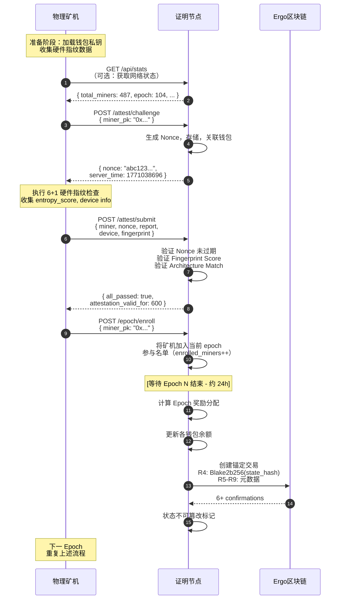

# RustChain 系统架构总览

> **文档版本**：v1.0（2026-05-19）
> **适用版本**：RustChain v2.2.1-rip200 及以上
> **节点地址**：`https://50.28.86.131`
> **区块链浏览器**：`https://50.28.86.131/explorer`

---

## 目录

1. [设计哲学：为何存在 RustChain](#1-设计哲学为何存在-rustchain)
2. [整体架构图](#2-整体架构图)
3. [核心组件](#3-核心组件)
4. [共识机制：Proof-of-Attestation](#4-共识机制proof-of-attestation)
5. [硬件指纹体系（6+1 验证）](#5-硬件指纹体系6+1-验证)
6. [代币经济学与奖励体系](#6-代币经济学与奖励体系)
7. [Ergo 锚定层](#7-ergo-锚定层)
8. [API 体系与节点交互](#8-api-体系与节点交互)
9. [Beacon 服务（分布式协调层）](#9-beacon-服务分布式协调层)
10. [安全机制](#10-安全机制)
11. [数据存储架构](#11-数据存储架构)
12. [技术栈汇总](#12-技术栈汇总)
13. [路线图与未来演进](#13-路线图与未来演进)

---

## 1. 设计哲学：为何存在 RustChain

传统区块链的共识机制都有其偏向：

| 共识机制 | 奖励对象 | 问题 |
|---------|---------|------|
| Proof-of-Work | GPU/ASIC 算力 | 能源消耗巨大，硬件集中化 |
| Proof-of-Stake | 资本持有量 | 富者愈富，缺乏物理世界连接 |
| Proof-of-Authority | 认证运营商 | 中心化风险，缺乏民主参与 |

**RustChain 选择了第三条路：Proof-of-Antiquity（古老证明）**。它奖励的是**计算历史的保存者**——那些维护着老旧硬件（PowerPC G4/G5、MIPS、Motorola 68K、Intel 386 等）的收藏家、爱好者和历史守护者。

核心设计原则：
- **物理唯一性**：每个 RTC 奖励对应一台真实物理设备，而非虚拟机或云实例
- **历史价值溢价**：越稀有的架构，乘数越高（最高 4.0x）
- **去中心化电力**：无需能源密集型算力竞赛，硬件的多样性本身即安全

---

## 2. 整体架构图

```
┌─────────────────────────────────────────────────────────────────────────┐
│                        RustChain 整体架构                                │
├─────────────────────────────────────────────────────────────────────────┤
│                                                                         │
│   ┌──────────────┐      ┌──────────────┐      ┌──────────────┐        │
│   │ Vintage Miner│      │ Vintage Miner│      │ Vintage Miner│        │
│   │  PowerPC G4  │      │  Intel 386   │      │  MIPS R10000  │        │
│   │   ⚙️ ×2.5    │      │   ⚙️ ×4.0    │      │   ⚙️ ×2.0    │        │
│   └──────┬───────┘      └──────┬───────┘      └──────┬───────┘        │
│          │                       │                       │               │
│          └───────────────────────┼───────────────────────┘               │
│                                  │                                        │
│                                  ▼                                        │
│   ┌───────────────────────────────────────────────────────────────┐     │
│   │                    Attestation Node                            │     │
│   │  ┌──────────────┐  ┌──────────────┐  ┌──────────────────────┐ │     │
│   │  │ Challenge    │  │ Fingerprint  │  │ Epoch                │ │     │
│   │  │ Issuer       │  │ Validator    │  │ Manager              │ │     │
│   │  │ (Nonce Gen)  │  │ (6+1 Checks) │  │ (Enrollment/Settle)  │ │     │
│   │  └──────────────┘  └──────────────┘  └──────────────────────┘ │     │
│   │                                                              │     │
│   │  ┌──────────────┐  ┌──────────────┐  ┌──────────────────────┐ │     │
│   │  │ SQLite Ledger │  │ Reward       │  │ Anchor               │ │     │
│   │  │ (Attestations)│  │ Calculator   │  │ Manager              │ │     │
│   │  └──────────────┘  └──────────────┘  └──────────────────────┘ │     │
│   └──────────────────────────┬──────────────────────────────────┘     │
│                              │                                           │
│              ┌───────────────┼────────────────┐                         │
│              ▼               ▼                ▼                         │
│     ┌────────────┐   ┌────────────┐   ┌────────────────┐                │
│     │  RustChain │   │   Ergo     │   │   Beacon       │                │
│     │  Local     │   │  Blockchain│   │   Service      │                │
│     │  SQLite DB │   │  (Anchoring│   │   (Discovery   │                │
│     │            │   │   Layer)   │   │   & Sync)      │                │
│     └────────────┘   └────────────┘   └────────────────┘                │
│                                                                         │
│   ┌───────────────────────────────────────────────────────────────┐    │
│   │                    外部用户层                                    │    │
│   │   Block Explorer   │   Wallet   │   3rd-Party Integrations    │    │
│   └───────────────────────────────────────────────────────────────┘    │
└─────────────────────────────────────────────────────────────────────────┘
```

### 2.1 数据流向图（简化版）

```
Miner (物理矿机)
    │
    │ ① POST /attest/challenge
    ▼
Attestation Node (证明节点)
    │
    │ ② 返回 Nonce（有效期10分钟）
    ▼
Miner
    │
    │ ③ 执行硬件指纹采集（6+1检查）
    │    - Clock Drift / Cache Timing / SIMD Identity
    │    - Thermal Entropy / Instruction Jitter / VM Detection
    │    - Physical Context Bonus
    ▼
Miner
    │
    │ ④ POST /attest/submit (Report + Commitment)
    ▼
Attestation Node
    │
    │ ⑤ 验证 Nonce + Fingerprint Score + Architecture Match
    ▼
Attestation Node
    │
    │ ⑥ 成功返回 → Miner 可信（有效期约10分钟）
    ▼
Miner
    │
    │ ⑦ POST /epoch/enroll
    ▼
Attestation Node
    │
    │ ⑧ 记录 epoch 参与 → 参与区块奖励分配
    ▼
Attestation Node (定期)
    │
    │ ⑨ 每 144 区块（≈24小时）
    │    计算 Blake2b256 承诺 → 写入 Ergo 链 R4-R9 寄存器
    ▼
Ergo Blockchain (外部锚定层)
    │
    │ ⑩ 6+ 确认后，RustChain 状态不可篡改
    ▼
Immutable Finality (最终确定性)
```

---

## 3. 核心组件

### 3.1 Attestation Node（证明节点）

证明节点是 RustChain 网络的核心服务器，负责整个网络的信任锚定。

**职责列表：**

```
证明节点职责矩阵
━━━━━━━━━━━━━━━━━━━━━━━━━━━━━━━━━━━━━━━━━━━
│ 功能模块          │ 具体工作                        │
├──────────────────┼────────────────────────────────┤
│ Nonce 管理        │ 生成、存储、过期验证一次性随机数   │
│ 指纹验证          │ 执行 6+1 检查算法                │
│ 账本维护          │ SQLite 存储所有有效认证记录        │
│ Epoch 管理        │ 周期（144块）奖励结算与分配       │
│ 锚定操作          │ 与 Ergo 链交互写入承诺哈希        │
│ 监控暴露          │ Prometheus /metrics 端点        │
━━━━━━━━━━━━━━━━━━━━━━━━━━━━━━━━━━━━━━━━━━━
```

**关键配置参数：**

| 参数 | 值 | 说明 |
|------|----|------|
| 节点地址 | `https://50.28.86.131` | 生产环境主节点 |
| 区块时间 | 600 秒（10分钟） | 每个 epoch 的时长 |
| 每 Epoch 区块数 | 144 | 24h = 144 × 600s |
| Nonce 有效期 | ~10 分钟 | 防重放攻击 |
| 最低质押 | 无 | 无需预质押 |
| 数据库 | SQLite | 本地轻量账本 |

**健康检查：**

```bash
# 检查节点状态
curl -sk https://50.28.86.131/health

# 返回示例
{
  "ok": true,
  "version": "2.2.1-rip200",
  "uptime_s": 31284,
  "db_rw": true
}
```

### 3.2 Physical Miners（物理矿机）

物理矿机是 RustChain 网络的价值载体——不是 GPU 矿机，而是真实的 vintage 计算设备。

**支持的经典架构（按乘数分层）：**

```
稀有度分层 ──────────────────────────────────────────
Legendary (×4.0)
  ├─ Intel 80386（1985）
  ├─ Motorola 68000（1979）
  ├─ MOS 6502（Apple II / Commodore 64）
  └─ MIPS R2000（1984）

Epic (×2.5)
  ├─ PowerPC G4（1999，PowerMac G4）
  ├─ Intel 80486（1989）
  └─ Intel Pentium I（1993）

Rare (×2.0)
  ├─ PowerPC G5（2003，PowerMac G5）
  ├─ DEC Alpha（1992）
  ├─ SPARC（1987）
  └─ IBM POWER8（2014）

Common (×0.8~1.0)
  ├─ 现代 x86_64（Skylake+ / Zen 3+）
  └─ 现代 ARM SBC（Raspberry Pi 等）

Flagged (×0)
  ├─ 虚拟机（VM）
  ├─ 模拟器
  └─ 指纹验证失败的设备
```

**矿机客户端工作流：**

```
┌─────────────────────────────────────────────┐
│              RustChain Miner Client         │
├─────────────────────────────────────────────┤
│                                             │
│  [启动] ──► [注册钱包地址]                   │
│                │                            │
│                ▼                            │
│         [请求 Nonce]                        │
│           /attest/challenge                │
│                │                            │
│                ▼                            │
│    ┌─ 采集硬件指纹（6+1检查） ─┐             │
│    │ ① 时钟偏移 & 振荡器漂移    │             │
│    │ ② 缓存时序指纹            │             │
│    │ ③ SIMD 单元身份           │             │
│    │ ④ 热漂移熵               │             │
│    │ ⑤ 指令路径抖动           │             │
│    │ ⑥ 反虚拟机检测           │             │
│    │ +1 物理上下文加权验证      │             │
│    └──────────────────────────┘             │
│                │                            │
│                ▼                            │
│    [构造 Attestation Payload]               │
│    { nonce + wallet + entropy }             │
│                │                            │
│                ▼                            │
│       [提交证明] POST /attest/submit         │
│                │                            │
│         ┌──────┴──────┐                     │
│         │  验证成功？  │                     │
│         └──────┬──────┘                     │
│          Yes ↘    ↙ No                      │
│       [记录epoch]  [标记Flagged，拒绝奖励]   │
│            │                               │
│            ▼                               │
│     [EPOCH 结算] ──► [领取 RTC 奖励]        │
│                                             │
└─────────────────────────────────────────────┘
```

### 3.3 Beacon Service（信标服务，v2.6 协议）

Beacon 是 RustChain 的分布式协调层，让矿机和 AI Agent 能够进行状态广播与点对点发现。

**Beacon 的三大核心能力：**

```
Beacon Service 功能
━━━━━━━━━━━━━━━━━━━━━━━━━━━━━━━━━
│ 功能          │ 说明                    │
├──────────────┼─────────────────────────┤
│ Heartbeat    │ 定期广播节点存活信号      │
│ Mayday       │ 故障节点发出求救信号      │
│ Peer         │ 分布式环境下的节点发现    │
│   Discovery  │                         │
│ AI Agent     │ AI Agent 状态同步        │
│   Sync       │                         │
━━━━━━━━━━━━━━━━━━━━━━━━━━━━━━━━━
```

Beacon 与主链的关系：Beacon 是**可选的**协调层，不参与共识，但可以大幅提升分布式矿场的运维效率。

---

## 4. 共识机制：Proof-of-Attestation

RustChain 的共识不是通过算力竞争实现的，而是通过**物理硬件的存在性证明**。

### 4.1 PoA vs 传统共识对比

```
共识机制能力对比
━━━━━━━━━━━━━━━━━━━━━━━━━━━━━━━━━━━━━━━━━━━━━━━━━━━
│ 维度        │ PoW         │ PoS          │ PoA (RustChain)  │
├────────────┼────────────┼──────────────┼──────────────────┤
│ 奖励依据    │ 算力         │ 代币质押量     │ 硬件古老度        │
│ 能源消耗    │ 高           │ 低            │ 低               │
│ 硬件要求    │ GPU/ASIC    │ 代币          │ Vintage 真机     │
│ 抗女巫攻击  │ 算力成本     │ 经济质押       │ 物理指纹唯一性    │
│ 中心化风险  │ 矿池集中化   │ 富者愈富       │ 架构多样性        │
│ 典型确认时间 │ 10-60min   │ 分钟级        │ ~10min/epoch    │
━━━━━━━━━━━━━━━━━━━━━━━━━━━━━━━━━━━━━━━━━━━━━━━━━━━
```

### 4.2 Epoch 周期详解

RustChain 的时间单位是 **Epoch**：

| 参数 | 值 | 说明 |
|------|----|------|
| 每个 Epoch 区块数 | 144 | 固定值 |
| 区块时间 | 600 秒（10分钟） | 固定值 |
| Epoch 时长 | 144 × 10min = **24 小时** | 每日结算 |
| Epoch 奖励池 | `epoch_pot` 字段 | 从 `/epoch` API 获取 |

**Epoch 结算流程：**

```
Epoch N 开始
    │
    ▼
矿机陆续完成 Attestation（通过 6+1 验证）
    │
    ▼
矿机调用 POST /epoch/enroll 注册参与本 epoch
    │
    ▼
[144 个区块后] Epoch N 结束
    │
    ▼
Reward Calculator：
  ① 统计所有 enrolled 矿机的 antiquity_weight
  ② 计算每台矿机的相对权重占比
  ③ 按比例分配 epoch_pot 中的 RTC
    │
    ▼
奖励写入各矿机钱包地址
    │
    ▼
Anchor Manager：
  ① 计算 Epoch N 状态的 Blake2b256 承诺哈希
  ② 写入 Ergo 区块链的 R4-R9 寄存器
  ③ 等待 6+ 确认 → 最终确定性达成
    │
    ▼
Epoch N+1 开始
```

---

## 5. 硬件指纹体系（6+1 验证）

这是 RustChain 最核心的安全创新。6+1 检查确保每台矿机都是**真实、独特、不可伪造**的物理硬件。

### 5.1 六大检查详解

```
硬件指纹检查流程
━━━━━━━━━━━━━━━━━━━━━━━━━━━━━━━━━━━━━━━━━━━━━━━━━━━
│ #  │ 检查名称             │ 测量指标           │ 防作弊目标        │
├────┼────────────────────┼──────────────────┼──────────────────┤
│ 1  │ 时钟偏移 & 振荡器漂移  │ 晶体振荡器唯一误差   │ 模拟时钟 ≠ 真硬件  │
│ 2  │ 缓存时序指纹          │ L1/L2/L3 延迟曲线  │ 缓存模拟 ≠ 物理CPU │
│ 3  │ SIMD 单元身份        │ AltiVec/SSE/NEON │ GPU/SIMD模拟≠真CPU│
│ 4  │ 热漂移熵             │ CPU 温漂波动模式    │ 恒温模拟 ≠ 真实散热 │
│ 5  │ 指令路径抖动          │ 微指令执行时间方差   │ 理想执行≠有噪声硬件 │
│ 6  │ 反虚拟机检测          │ hypervisor签名/    │ VM/容器 → 拒绝     │
│    │                    │ VM痕迹              │                    │
├────┴────────────────────┴──────────────────┴──────────────────┤
│ +1 │ 物理上下文加权验证  │ 序列号+MAC+制造数据库  │ 硬件身份交叉核验     │
━━━━━━━━━━━━━━━━━━━━━━━━━━━━━━━━━━━━━━━━━━━━━━━━━━━
```

### 5.2 检查 1：时钟偏移与振荡器漂移

每颗 CPU 的晶体振荡器都有独特的频率漂移特征，这个特征在物理上是不可复制的：

```
原理：晶体振荡器漂移
━━━━━━━━━━━━━━━━━━━━━━━━━━━━━
CPU 晶体 → 分频电路 → 系统时钟
    ↑
    └── 每个晶体都有 ppm（百万分比）级别的
        独特误差，这个误差随温度、电压变化
        呈现非线性特征

验证方法：
  1. Node 发送精确时间戳 T₁
  2. Miner 测量接收时刻 T₂
  3. Miner 采样 1000+ 次时钟漂移
  4. 提交：mean_drift, variance_drift, skewness
  5. Node 比对是否与声称的 CPU 型号匹配
━━━━━━━━━━━━━━━━━━━━━━━━━━━━━
```

### 5.3 检查 2：缓存时序指纹

不同 CPU 架构的缓存层级（大小、延迟、关联度）完全不同：

```
缓存时序指纹示例（理论值）
━━━━━━━━━━━━━━━━━━━━━━━━━━━━━━━━━
│ CPU 型号      │ L1 延迟  │ L2 延迟  │ L3 延迟 │ 特征曲线       │
├──────────────┼─────────┼─────────┼─────────┼───────────────┤
│ Pentium 4    │ ~1 cycle│ ~5 cycle│ ~15cycle│ 线性下降明显   │
│ PowerPC G4   │ ~1 cycle│ ~6 cycle│ N/A     │ 无 L3，曲线平缓│
│ MIPS R10000  │ ~2 cycle│ ~7 cycle│ ~12cycle│ 阶梯式下降    │
│ Modern x86   │ ~4 cycle│ ~12cycle│ ~40cycle│ 三段式阶梯    │
━━━━━━━━━━━━━━━━━━━━━━━━━━━━━━━━━
→ 通过测量不同访问步长的内存延迟，可推断 CPU 架构
→ 伪造架构的模拟器无法复现真实的缓存行为
```

### 5.4 检查 6：反虚拟机检测

VM/容器检测清单：

```
VM/模拟器检测项
━━━━━━━━━━━━━━━━━━━━━━━━━━━━━━
│ 检测项                   │ 正常硬件   │ VM/模拟器    │
├─────────────────────────┼──────────┼─────────────┤
│ hypervisor 文件         │ 不存在    │ /dev/vmm /  │
│                         │          │ /dev/hyperv  │
├─────────────────────────┼──────────┼─────────────┤
│ CPUID hypervisor bit    │ 0        │ 1           │
├─────────────────────────┼──────────┼─────────────┤
│ MAC 地址来源（VMware/   │ N/A      │ 固定前缀     │
│ VirtualBox）             │          │             │
├─────────────────────────┼──────────┼─────────────┤
│ 设备序列号相似度         │ 高度分散   │ 批量克隆     │
├─────────────────────────┼──────────┼─────────────┤
│ 电池状态（虚拟机常无电池）│ 正常      │ "无电池"     │
├─────────────────────────┼──────────┼─────────────┤
│ 硬件随机数 vs 软件 RNG  │ 物理熵源  │ 软件生成     │
└─────────────────────────┴──────────┴─────────────┘
→ 任何一项失败 → multiplier = 0x（零奖励）
```

### 5.5 SOPHIA 验证器（高级语义检查）

`RIP-0306-sophia-attestation-inspector` 是 6+1 检查的增强版，它不只看**独立阈值**，还分析各指标之间的**语义一致性**：

```
SOPHIA 语义一致性检查
━━━━━━━━━━━━━━━━━━━━━━━━━━━━━━━━━━━━━━━━━━━
│ 场景                    │ 判断结果              │
├─────────────────────────┼───────────────────────┤
│ 时钟漂移 CV=0.042 ✓     │ 在 P4 声称年龄范围内   │
│ 但 L2/L3 比值=1.8 ❌   │ P4 不应该有如此均匀的  │
│                         │ 缓存层级 → 标记可疑    │
├─────────────────────────┼───────────────────────┤
│ SIMD 特征 ✓              │ 声称 ARM NEON         │
│ 但 thermal drift ✓       │ 散热模式不符 ARM 预期  │
│                         │ → 建议下个 epoch 监控  │
├─────────────────────────┼───────────────────────┤
│ 所有独立指标 ✓            │ 但彼此之间语义矛盾     │
│                         │ → SOPHIA 标记为       │
│                         │ "可信但不协调"         │
└─────────────────────────┴───────────────────────┘
```

---

## 6. 代币经济学与奖励体系

### 6.1 RTC 代币基础

| 属性 | 值 |
|------|----|
| 代币符号 | **RTC**（RustChain Token） |
| 类型 | Utility Token（实用型代币） |
| 参考汇率 | 1 RTC ≈ **$0.10 USD** |
| 总供应量（当前） | 8,388,608 RTC（见 `/epoch` API） |
| 分配方式 | PoA 挖矿产出（无预挖、无 ICO） |

### 6.2 奖励乘数体系

```
RTC 奖励权重计算公式
━━━━━━━━━━━━━━━━━━━━━━━━━━━━━━━━━━━━━━━━━━━

Miner_Weight = Base_Multiplier × Time_Decay × Bonus

其中：

Base_Multiplier（基础乘数）
  ├─ Legendary（传奇）:  4.0x  → Intel 386, 68000, MIPS R2000
  ├─ Epic（史诗）:       2.5x  → PowerPC G4, Pentium I
  ├─ Rare（稀有）:        2.0x  → PowerPC G5, SPARC, POWER8
  ├─ Common（普通）:      0.8x~1.0x → 现代 x86_64
  └─ Flagged（标记）:     0x    → VM / 模拟器

Time_Decay（时间衰减，仅 vintage 硬件适用）
  └─ 每年 -15%（从 2025 创世区块开始）

Bonus（额外加成）
  ├─ 忠诚加成：≤5年新硬件，每年 +15%，上限 +50%
  └─ 服务器加成：Intel Xeon / AMD EPYC，固定 +10%
━━━━━━━━━━━━━━━━━━━━━━━━━━━━━━━━━━━━━━━━━━━
```

**完整示例：**

```
案例 1：一台 PowerMac G4 (PowerPC G4, Epic 级)
  Base:          2.5x
  Time Decay:    2026-2025 = 1年 → 1.0 - (0.15 × 1) = 0.85
  Final:         1.0 + (1.5 × 0.85) = 1.0 + 1.275 = 2.275x

案例 2：一台 Intel 386 (Legendary 级)
  Base:          4.0x
  Time Decay:    2026-2025 = 1年 → 1.0 - (0.15 × 1) = 0.85
  Final:         1.0 + (3.0 × 0.85) = 1.0 + 2.55  = 3.55x

案例 3：AWS EC2 x86_64 VM（现代通用）
  Base:          1.0x（Common）
  VM Detection: FAILED → multiplier = 0x
  Final:         0x（零奖励，VM 不被接受）
```

### 6.3 Epoch 奖励分配算法

```
Epoch N 奖励分配
━━━━━━━━━━━━━━━━━━━━━━━━━━━━━━━━━━

Step 1: 获取本 epoch 参与矿机列表
  miners_enrolled = [M₁, M₂, M₃, ..., Mₖ]

Step 2: 计算每台矿机的权重
  For each miner Mᵢ:
    weight[Mᵢ] = BaseMultiplier(Mᵢ.architecture)
                 × TimeDecay(Mᵢ.age)
                 × LoyaltyBonus(Mᵢ.uptime)
                 × ServerBonus(Mᵢ.cpu_type)

Step 3: 计算相对权重占比
  total_weight = Σ weight[Mᵢ]
  share[Mᵢ]    = weight[Mᵢ] / total_weight

Step 4: 分配 epoch_pot
  reward[Mᵢ] = share[Mᵢ] × epoch_pot

Step 5: 写入钱包余额
  balance[Mᵢ] += reward[Mᵢ]

━━━━━━━━━━━━━━━━━━━━━━━━━━━━━━━━━━
```

---

## 7. Ergo 锚定层

### 7.1 为什么需要 Ergo

RustChain 的本地账本（SQLite）足够快，但作为单节点数据库，无法防止**历史篡改攻击（Long-Range Attack）**。Ergo 区块链提供了外部的、经过时间验证的不可篡改性。

**Ergo 锚定的安全价值：**

```
Ergo 锚定安全模型
━━━━━━━━━━━━━━━━━━━━━━━━━━━━━━━━━━━━━━━━━━

传统区块链风险：
  攻击者购买旧私钥 → 从历史某 epoch 重写区块链
  → 双花攻击成功

RustChain + Ergo 防护：
  RustChain 每 144 区块（24小时）
  └─► 计算状态承诺哈希（Blake2b256）
          └─► 写入 Ergo Tx Register R4
              └─► R5: miner_count（矿工数）
              └─► R6: miner_ids（矿工ID列表）
              └─► R7: architectures（架构统计）
              └─► R8: slot_height（槽高度）
              └─► R9: timestamp（时间戳）

  6 Ergo 确认后（约 40 分钟）：
  └─► RustChain Epoch N 状态被永久锚定
      └─► 攻击者若重写 RustChain 本地链：
          → 新承诺哈希 ≠ Ergo 中存储的哈希
          → 攻击被立即发现

━━━━━━━━━━━━━━━━━━━━━━━━━━━━━━━━━━━━━━━━━━
```

### 7.2 锚定交易结构

```
Ergo 锚定交易（RustChain → Ergo）
━━━━━━━━━━━━━━━━━━━━━━━━━━━━━━━━━━━━━━━━━━
│ 寄存器  │ 内容              │ 说明                 │
├────────┼──────────────────┼──────────────────────┤
│ R4     │ Blake2b256 hash  │ RustChain Epoch 状态承诺│
│ R5     │ miner_count      │ 本 epoch 矿工总数      │
│ R6     │ miner_ids[]      │ 各矿工 ID 的 Merkle Root│
│ R7     │ architectures[]  │ 各架构的参与权重分布    │
│ R8     │ slot_height      │ 对应的 RustChain 槽号   │
│ R9     │ timestamp        │ Unix 时间戳           │
└────────┴──────────────────┴──────────────────────┘
```

### 7.3 外部审计验证流程

任何人都可以验证 RustChain 的历史数据完整性：

```bash
# 1. 获取某个 Epoch 的 Ergo 锚定交易 ID
curl https://50.28.86.131/api/anchor/{epoch_number}

# 2. 从 Ergo 浏览器查询该交易，获取 R4 寄存器（承诺哈希）
curl https://api.ergo.pl/v1/boxes/unspent/byTokenId/{anchor_nft_id}

# 3. 在本地重新计算该 Epoch 的状态哈希
python3 verify_anchor.py --epoch 104

# 4. 比对两者——相等则验证通过
#   若不相等 → 存在数据篡改
```

---

## 8. API 体系与节点交互

RustChain 节点提供 RESTful API，Base URL：`https://50.28.86.131`

### 8.1 完整端点矩阵

```
API 端点总览
━━━━━━━━━━━━━━━━━━━━━━━━━━━━━━━━━━━━━━━━━━━━━━━━━━━
│ 方法   │ 端点                        │ 功能           │ 认证  │
├────────┼────────────────────────────┼───────────────┼──────┤
│ GET    │ /health                     │ 节点健康检查     │ 公开  │
│ GET    │ /api/stats                  │ 全网统计数据     │ 公开  │
│ GET    │ /epoch                      │ 当前 Epoch 信息  │ 公开  │
│ GET    │ /balance/{miner_pk}         │ 矿工余额查询     │ 公开  │
│ POST   │ /attest/challenge           │ 获取认证挑战码   │ 钱包  │
│ POST   │ /attest/submit               │ 提交硬件指纹报告 │ 签名  │
│ POST   │ /epoch/enroll               │ 注册参与 Epoch  │ 钱包  │
│ POST   │ /withdraw/register           │ 注册提现密钥    │ 钱包  │
│ POST   │ /withdraw/request            │ 发起提现请求    │ 钱包  │
│ GET    │ /withdraw/status/{id}        │ 提现状态查询    │ 公开  │
│ GET    │ /withdraw/history/{miner_pk} │ 提现历史       │ 公开  │
│ GET    │ /metrics                     │ Prometheus 指标 │ 公开  │
━━━━━━━━━━━━━━━━━━━━━━━━━━━━━━━━━━━━━━━━━━━━━━━━━━━
```

### 8.2 典型交互时序图（Mermaid）



### 8.3 Python SDK 集成示例

```python
"""
RustChain Python SDK 使用示例
前提：pip install requests
"""
import requests
import json

NODE = "https://50.28.86.131"
WALLET_PK = "0x" + "00" * 32  # 替换为你的钱包公钥

# Step 1: 健康检查
def health_check():
    r = requests.get(f"{NODE}/health", verify=False, timeout=10)
    data = r.json()
    assert data["ok"], f"Node is not healthy: {data}"
    print(f"✅ Node OK: v{data['version']}, uptime={data['uptime_s']}s")

# Step 2: 获取 Epoch 信息
def get_epoch_info():
    r = requests.get(f"{NODE}/epoch", verify=False, timeout=10)
    data = r.json()
    print(f"📊 Epoch {data['epoch']}: "
          f"{data['enrolled_miners']} miners enrolled, "
          f"pot = {data['epoch_pot']} RTC")
    return data

# Step 3: 请求认证挑战
def request_challenge(miner_pk):
    r = requests.post(
        f"{NODE}/attest/challenge",
        json={"miner_pk": miner_pk},
        verify=False, timeout=10
    )
    return r.json()  # {"nonce": "...", "server_time": ...}

# Step 4: 提交认证（伪代码 - 真实场景需采集硬件指纹）
def submit_attestation(miner_pk, nonce, hardware_report):
    payload = {
        "miner": miner_pk,
        "miner_id": "MyVintageMac",
        "nonce": nonce,
        "report": {
            "entropy_score": 0.0045,
            "derived": {"mean_ns": 25000, "variance_ns": 450}
        },
        "device": {
            "family": "PowerPC",
            "arch": "g4",
            "model": "PowerMac3,6"
        },
        "fingerprint": {
            "all_passed": True,
            "checks": {"check1": True, "check2": True, "check3": True}
        }
    }
    r = requests.post(
        f"{NODE}/attest/submit",
        json=payload,
        verify=False, timeout=10
    )
    return r.json()

# Step 5: 参与 Epoch
def enroll_in_epoch(miner_pk):
    r = requests.post(
        f"{NODE}/epoch/enroll",
        json={"miner_pk": miner_pk},
        verify=False, timeout=10
    )
    return r.json()

# 执行完整流程
if __name__ == "__main__":
    health_check()
    get_epoch_info()
    challenge = request_challenge(WALLET_PK)
    print(f"🔑 Nonce: {challenge['nonce']}")
    # 实际使用中，这里需要接入硬件指纹采集模块
```

---

## 9. Beacon 服务（分布式协调层）

Beacon Service（Beacon 2.6 协议）是 RustChain 网络的**可选运维层**，为分布式矿场和 AI Agent 提供协调能力。

### 9.1 Beacon 协议栈

```
Beacon Service 协议架构
━━━━━━━━━━━━━━━━━━━━━━━━━━━━━━━━━━━━━━━━━━

┌─────────────────────────────────────────┐
│            Beacon Service Layer          │
│           (Beacon 2.6 Protocol)          │
├─────────────┬─────────────┬──────────────┤
│  Heartbeat  │   Mayday   │  Peer Disc.  │
│  Broadcaster│  (故障告警) │  (分布式发现) │
└──────┬──────┴──────┬──────┴──────┬───────┘
       │             │             │
       ▼             ▼             ▼
  ┌─────────┐  ┌──────────┐  ┌──────────┐
  │ Miner   │  │ AI Agent │  │ 其他节点  │
  │ Clients │  │  Orch.   │  │  Discovery│
  └─────────┘  └──────────┘  └──────────┘
       │             │             │
       └─────────────┴─────────────┘
                    │
                    ▼
            ┌──────────────┐
            │  RustChain   │
            │  Attestation │
            │     Node     │
            └──────────────┘
```

### 9.2 Beacon 消息类型

| 消息类型 | 触发条件 | 广播范围 | 处理方式 |
|---------|---------|---------|---------|
| `heartbeat` | 每 30 秒（可配置） | 全网 | 节点记录活跃状态 |
| `mayday` | 矿机失联 > 5 分钟 | 全网 | 触发备用节点切换 |
| `peer_discovery` | 节点加入/离开 | 局部邻域 | 更新 P2P 邻接表 |
| `ai_status` | AI Agent 状态变化 | AI Agent 专属频道 | 任务协调 |

### 9.3 Beacon 与主链的关系

```
Beacon ≠ 共识层

Beacon 的职责：
  ✅ 矿机存活监控与告警
  ✅ 多节点环境下的故障转移
  ✅ AI Agent 的任务协调
  ✅ P2P 节点发现与网络拓扑维护

Beacon 不负责：
  ❌ 区块生产（Attestation Node 负责）
  ❌ 奖励分配（完全由 Epoch Manager 处理）
  ❌ 账本存储（SQLite 账本独立维护）
  ❌ Ergo 锚定（Anchor Manager 独立处理）

Beacon 是"运维协调层"，不是"共识层"
━━━━━━━━━━━━━━━━━━━━━━━━━━━━━━━━━━━━━
```

---

## 10. 安全机制

### 10.1 多层防护体系

```
RustChain 安全架构（六层）
━━━━━━━━━━━━━━━━━━━━━━━━━━━━━━━━━━━━━━━━━━━

第1层：物理唯一性
  └─► 6+1 硬件指纹检查 → 防 VM / 模拟器 / 云实例

第2层：密码学承诺
  └─► Nonce + wallet + entropy → SHA256 承诺
  └─► 防重放攻击（Nonce 10分钟过期）

第3层：架构语义验证
  └─► SOPHIA 验证器（语义一致性分析）
  └─► 防低成本多架构伪装

第4层：Epoch 参与控制
  └─► 矿机必须 enrolled 才能领奖励
  └─► 防"幽灵矿机"（只 attest 不参与）

第5层：外部不可篡改性
  └─► Ergo 区块链锚定（6+ 确认）
  └─► 防历史重写攻击

第6层：社会共识
  └─► @Scottcjn（或标注的自动化账户）
  └─► 才可授权 RTC 奖金分发
  └─► 防支付授权欺骗

━━━━━━━━━━━━━━━━━━━━━━━━━━━━━━━━━━━━━━━━━━━
```

### 10.2 支付授权防骗

⚠️ **重要安全警示**：RTC 赏金只能由 `@Scottcjn`（或带有项目签发的 `pending_id` + `tx_hash` 的标注自动化账户）授权支付。

**验证 RTC 付款真实性的步骤：**

```
识别真伪 RTC 支付通知
━━━━━━━━━━━━━━━━━━━━━━━━━━━━━━━

✅ 真实通知特征：
  1. 来自 GitHub @Scottcjn 的评论
  2. 包含项目的 pending_id（格式如 PRJ-XXX）
  3. 包含可验证的 tx_hash（可在链上查询）
  4. 金额与 bounty 页面标注一致

❌ 伪造通知特征（立即忽略）：
  1. 来自陌生账号
  2. 只说"我会发送 RTC"但无 tx_hash
  3. 要求你先发送 ETH/其他代币
  4. 急迫性措辞（"立即确认，否则过期"）

如果你收到可疑的"支付通知"：
  → 立即在 bounty issue 下 @Scottcjn 确认
  → 参考：SECURITY.md § Payment-Authority Impersonation
━━━━━━━━━━━━━━━━━━━━━━━━━━━━━━━
```

---

## 11. 数据存储架构

### 11.1 本地存储（SQLite）

每个 Attestation Node 运行一个本地 SQLite 数据库：

```
RustChain SQLite Schema（主要表）
━━━━━━━━━━━━━━━━━━━━━━━━━━━━━━━━━━━━━━━━━━━

attestations
  ├─ id (PK, auto increment)
  ├─ miner_pk (钱包公钥)
  ├─ miner_id (友好设备名)
  ├─ epoch (参与 epoch 号)
  ├─ nonce (使用的 nonce)
  ├─ entropy_score (熵得分)
  ├─ fingerprint_all_passed (bool)
  ├─ architecture (如 "PowerPC G4")
  ├─ multiplier (本轮使用的乘数)
  ├─ timestamp (认证时间)
  └─ tx_hash (可选，关联的 Ergo 锚定交易)

epochs
  ├─ epoch_number (PK)
  ├─ start_slot
  ├─ end_slot
  ├─ enrolled_miners (JSON)
  ├─ epoch_pot (RTC 数量)
  ├─ anchor_tx_id (Ergo 锚定交易 ID)
  └─ finalized (bool, 是否已锚定)

rewards
  ├─ id (PK)
  ├─ miner_pk
  ├─ epoch_number
  ├─ reward_amount (RTC)
  ├─ weight (参与权重)
  └─ distributed_at

━━━━━━━━━━━━━━━━━━━━━━━━━━━━━━━━━━━━━━━━━━━
```

### 11.2 区块浏览器数据流

```
区块浏览器数据来源
━━━━━━━━━━━━━━━━━━━━━━━━

50.28.86.131/explorer
    │
    ├──► 从 SQLite 实时读取
    │        ├─ 最新区块（slot 15066+）
    │        ├─ 当前 Epoch（epoch 104）
    │        ├─ 矿工余额
    │        └─ 认证记录
    │
    └──► 从 Ergo 链读取（定期同步）
             └─► 锚定历史（不可篡改证据）

用户访问 explorer 时：
  ① 浏览器请求 /api/blocks/latest
  ② Node 从 SQLite 返回最新 20 个区块摘要
  ③ 浏览器渲染区块列表、矿工排名等信息
━━━━━━━━━━━━━━━━━━━━━━━━
```

---

## 12. 技术栈汇总

```
RustChain 技术栈一览
━━━━━━━━━━━━━━━━━━━━━━━━━━━━━━━━━━━━━━━━━━━

【共识与协议】
  共识算法      │ Proof-of-Antiquity (PoA)
  改进提案       │ RIP-200（现代化认证流程）
               │ RIP-0306（SOPHIA 验证器）
               │ RIP-0309（轮换测量机制）
  加密承诺       │ Blake2b256（Ergo 锚定哈希）
  Nonce 机制     │ 一次性随机数（防重放）
  时钟同步       │ NTP + 振荡器漂移分析

【节点与存储】
  节点框架       │ Python（主节点）
  数据库         │ SQLite（轻量账本）
  锚定层         │ Ergo Blockchain（外部安全）
  锚定寄存器     │ Ergo R4-R9（Box Registers）

【硬件指纹】
  时钟分析       │ ppm 漂移统计（均值/方差/偏度）
  缓存时序       │ 跨缓存层级访问延迟曲线
  SIMD 检测      │ CPUID / 指令集探测
  热漂移         │ 温漂熵采集（热敏采样）
  指令抖动       │ 微指令执行时间方差分析
  VM 检测        │ hypervisor 签名扫描
  语义验证       │ SOPHIA（跨指标一致性）

【API 与监控】
  API 框架       │ RESTful HTTPS
  API Base URL   │ https://50.28.86.131
  API 版本       │ v2.2.1-rip200
  监控端点       │ GET /metrics（Prometheus 格式）
  健康检查       │ GET /health

【协调层】
  Beacon 协议    │ Beacon 2.6
  心跳广播       │ 每 30 秒（可配置）
  故障检测       │ 5 分钟无心跳触发 Mayday

【代币】
  代币符号       │ RTC（RustChain Token）
  代币类型       │ Utility Token
  参考汇率       │ 1 RTC ≈ $0.10 USD
  总供应（当前）  │ 8,388,608 RTC
  分配机制       │ PoA 挖矿产出（无 ICO）
━━━━━━━━━━━━━━━━━━━━━━━━━━━━━━━━━━━━━━━━━━━
```

---

## 13. 路线图与未来演进

### 13.1 已实现的里程碑

| 时间 | 里程碑 | 说明 |
|------|-------|------|
| 2025 | Genesis（创世） | RustChain 主网启动，PoA 共识上线 |
| 2025 Q4 | RIP-200 | 现代化认证流程升级 |
| 2026 Q1 | SOPHIA 验证器 | RIP-0306，语义一致性检查 |
| 2026 Q1 | RustChain Bounties | 赏金系统上线，500+ 赏金任务 |
| 2026 Q2 | Ergo 锚定增强 | RIP-0309，轮换测量机制 |

### 13.2 活跃的 RIP 提案

| RIP 编号 | 内容 | 状态 |
|---------|------|------|
| RIP-0005 | 核心协议 v5 | 已启用 |
| RIP-0008 | 共识改进 | 已启用 |
| RIP-0009 | 网络层优化 | 已启用 |
| RIP-0142 | 矿工权重调整 | 已启用 |
| RIP-0143 | 奖励分配优化 | 已启用 |
| RIP-0144 | 安全性加固 | 已启用 |
| RIP-0306 | SOPHIA 验证器 | 已启用 |
| RIP-0309 | 轮换测量机制 | 已启用 |

### 13.3 网络现状（截至 2026-05-19）

```
RustChain 网络实时状态
━━━━━━━━━━━━━━━━━━━━━━━━━━━
│ 指标             │ 当前值            │
├──────────────────┼───────────────────┤
│ 全网矿工数       │ 487+              │
│ 当前 Epoch       │ ~104              │
│ 每 Epoch 奖励池  │ ~1.5 RTC          │
│ 总已支付 RTC     │ 22,756 RTC        │
│ 区块时间         │ 600 秒            │
│ 活跃赏金数       │ 131+              │
│ 赏金池总量       │ 5,900+ RTC        │
│ 节点版本         │ 2.2.1-rip200      │
│ 安全特性         │ no_mock_sigs,     │
│                 │ mandatory_admin_key│
│                 │ replay_protection, │
│                 │ validated_json     │
━━━━━━━━━━━━━━━━━━━━━━━━━━━
```

---

## 附录：快速参考卡片

### A. 常用 API 速查

```bash
# 节点健康
curl -sk https://50.28.86.131/health

# 全网统计
curl -sk https://50.28.86.131/api/stats

# 当前 Epoch
curl -sk https://50.28.86.131/epoch

# 矿工余额
curl -sk https://50.28.86.131/balance/0x...（钱包公钥）

# Prometheus 指标
curl -sk https://50.28.86.131/metrics
```

### B. 关键资源链接

| 资源 | 链接 |
|------|------|
| 主代码库 | https://github.com/Scottcjn/RustChain |
| 赏金面板 | https://github.com/Scottcjn/rustchain-bounties |
| 区块浏览器 | https://50.28.86.131/explorer |
| Discord | https://discord.gg/VqVVS2CW9Q |
| Q1 2026 进展报告 | `docs/DEVELOPER_TRACTION_Q1_2026.md` |

### C. 贡献指南速查

| 任务类型 | 奖励范围 | 在哪里提交 |
|---------|---------|----------|
| 文档改进 | 1-5 RTC | `docs/` 目录 PR |
| Bug 修复 | 5-25 RTC | 对应代码仓库 PR |
| 新功能 | 25-100 RTC | 对应代码仓库 PR |
| 安全审计 | 100-200 RTC | 私信 @Scottcjn（协调披露） |

---

*本文档为 RustChain Documentation Sprint #72 产出。*
*如需更新或纠错，请在 [rustchain-bounties](https://github.com/Scottcjn/rustchain-bounties) 提交 Issue 或 PR。*
*返回：[协议文档目录](./protocol/README.md)*
